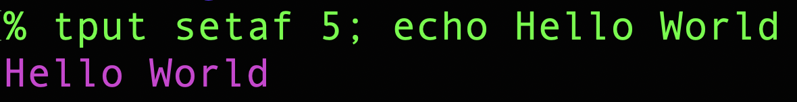

# Linux Color Output

## Usage

Use ```tput``` command to print with color.

```bash
tput setaf 5; echo Hello World
```

### Using tput directly



```bash
tput setab 6; echo Background cyan
```


> ```setaf``` is used to change font color

> ```setab``` is used to change background color

### Using tput in Command substitution

```bash
# echo "$(tput setaf 0)$(tput setab 7)LogixOwl"
echo "$(tput setaf 0;tput setab 7)LogixOwl"
```


```bash
echo "$(tput setaf 5)Logix$(tput bold)$(tput smul)Owl"
```


> You can also assign in a variable

### Using tput in Variable

```bash
bgred=`tput setab 1`
yellow=`tput setaf 3`
reset=`tput sgr0`
echo "${yellow}yellow ${bgred}in red bg${reset}"
```


| Num | Colour |
| --- | --- |
| 0 | black |
| 1 | red |
| 2 | green |
| 3 | yellow |
| 4 | blue |
| 5 | magenta |
| 6 | cyan |
| 7 | white |

| Command | Description |
| --- | --- |
| ```tput bold``` | bold |
| ```tput dim```  | dim (half-bright) |
| ```tput smul``` | Enable underline |
| ```tput rmul``` | Disable underline |
| ```tput bel``` |  Play a bell |
| ```tput sgr0``` | Reset text format to the terminal's default |
